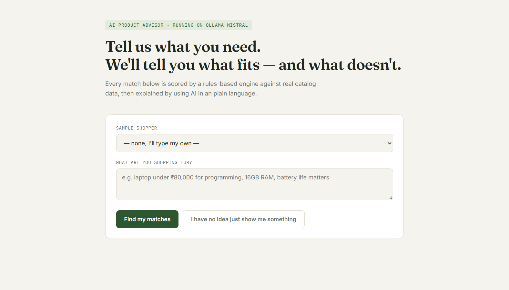
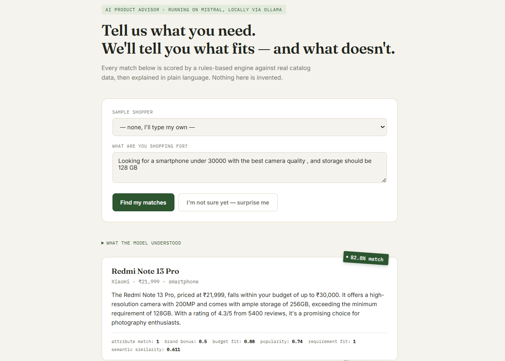
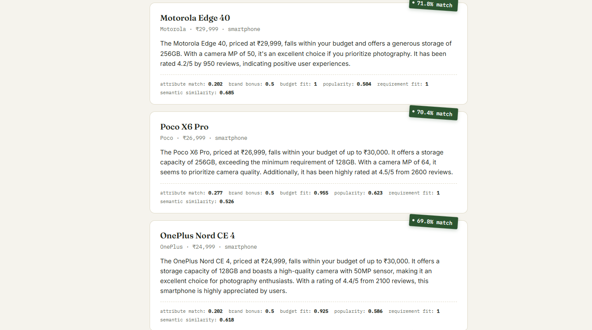
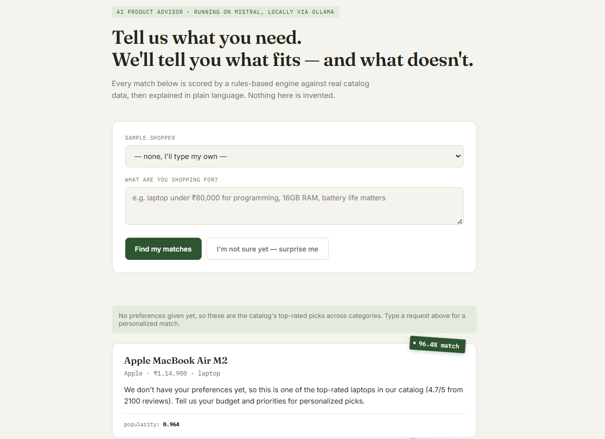
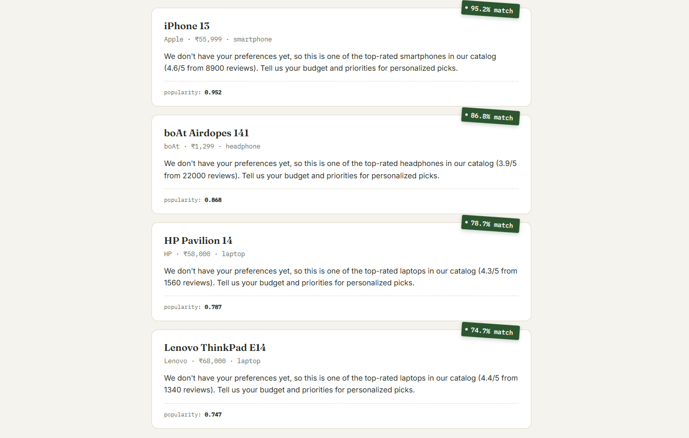

<div align="center">

# 🛒 Product Recommendation Agent

### AI-Powered Personalized Product Recommendation System

Suggests products to users based on preferences, budget, features, and semantic intent using LLMs, content-based filtering, and ranking algorithms.


</div>   

---

## 📚 Table of Contents

- [🚀 Overview](#-overview)
- [✨ Features](#-features)
- [🏗️ Architecture](%EF%B8%8F-architecture)
- [📂 Project Structure](#-project-structure)
- [📊 Dataset](#-dataset)
- [🔄 Recommendation Workflow](#recommendation-workflow)
- [⚙️ Installation](#%EF%B8%8F-installation)
- [▶️ Running the Project](#%EF%B8%8F-running-the-project)
- [📝 Sample Inputs & Outputs](#-sample-inputs--outputs)
- [🧪 Testing](#-testing)
- [📸 Screenshots](#-screenshots)
- [⚖️ Tradeoffs & Limitations](#%EF%B8%8F-tradeoffs--limitations)
- [🚀 Future Improvements](#-future-improvements)

---

# 🚀 Overview

The Product Recommendation Agent is an AI-powered recommendation system that helps users discover products based on:

- Budget
- Product category
- Required features
- Preferred brands
- Usage intent

The system combines:

1. LLM Extract Parse Preferences
2. Content-Based Recommendation
3. Semantic Similarity Search
4. LLM-Generated Explanations

---

# ✨ Features

✅ Product Catalog Management

✅ User Preference Extraction

✅ Semantic Query Understanding

✅ Cold Start Recommendation

✅ Ranked Product Suggestions

✅ Explainable AI Recommendations

✅ Local LLM Support via Ollama

✅ Interactive Web Interface

---

# 🏗️ Architecture

```text
                     USER
                      │
                      ▼

          Natural Language Query
                      │
                      ▼

          Ollama (Mistral Model)
                      │
                      ▼

         Preference Extraction
                      │
                      ▼

      Structured User Preferences
                      │
                      ▼

      Recommendation Engine
      ├── Hard Filtering
      ├── Attribute Matching
      ├── Budget Scoring
      ├── Semantic Similarity
      └── Popularity Score
                      │
                      ▼

            Ranked Products
                      │
                      ▼

       AI Explanation Generator
                      │
                      ▼

          Final Recommendations
```

---

# 📂 Project Structure

```text
backend/
├── app.py
├── recommendation.py
├── scoring.py
├── llm_service.py

frontend/
├── index.html
├── script.js
└── style.css


Screenshots/
├── Homepage.png
├── Recommendation_1.png
├── Recommendation_2.png
├── Cold_Satrt_1.png
├── Cold_Start_2.png

tests/
└── test_recommendation.py
```

---

# 📊 Dataset

The dataset contains products with:

- Product Name
- Brand
- Category
- Price
- RAM
- Storage
- Battery
- Camera
- rating
- Description

Supported Categories:

- Laptop
- Smartphone
- Headphone

---

# 🔄Recommendation Workflow

### Step 1

User enters query:

```text
I need a laptop under 50000 with 16GB RAM.
```

### Step 2

LLM extracts:

```json
{
  "category": "laptop",
  "budget_max": 50000,
  "min_ram_gb": 16
}
```

### Step 3

Hard Filtering

- Category Filter
- Budget Filter

### Step 4

Scoring

Final Score =

```text
0.35 × Attribute Match
+
0.25 × Budget Fit
+
0.15 × Brand Bonus
+
0.15 × Popularity
+
0.10 × Semantic Similarity
```

### Step 5

Top products are ranked.

### Step 6

LLM generates explanation.

---

# ⚙️ Installation

Create Virtual Environment

```bash
python -m venv venv
```

Activate

Windows

```bash
venv\Scripts\activate
```

Install Dependencies

```bash
pip install -r requirements.txt
```

---

# 🦙 Install Ollama

Download:

https://ollama.com

Pull Model:

```bash
ollama pull mistral
```

Verify:

```bash
ollama run mistral
```

---

# ▶️ Running the Project

Backend

```bash
cd backend

python app.py
```

Frontend

Open:

```text
frontend/index.html
```

Application:

```text
http://127.0.0.1:5000
```

---

# 📝 Sample Inputs & Outputs

Input:

```text
I need a laptop under 50000 with 16GB RAM.
```

Output:

```text
MSI Modern 14
Match Score: 66.9%

Reason:
Matches budget and RAM requirement.
Suitable for programming and office work.
```

Sample Input :

User: Kuvempu – Photography Enthusiast

Query:
Looking for a smartphone under 30000 with the best possible camera

Expected Behavior:
- Detect Smartphone category
- Extract budget = 30000
- Prioritize camera quality
- Rank camera-focused phones higher

---

# 🧪 Testing

Run all tests

```bash
python -m pytest tests/test_recommendation.py -v
```

Expected:

```text
7 PASSED
```

---

# 📸 Screenshots

## Home Page



## Recommendation Output





## Cold Start Recommendation





---

# ⚖️ Tradeoffs & Limitations

Current Version

- Small dataset
- LLM Parses Preferences
- Content-based recommendation only
- No collaborative filtering
- Local LLM Generates Explanation
- Limited categories

Why this approach?

- Fast
- Lightweight
- Easy to explain
- Runs locally

---

# 🚀 Future Improvements

- Vector Database
- RAG-based recommendations
- User behavior tracking
- Collaborative filtering
- Real-time e-commerce integration
- Multi-agent architecture

---

# 👨‍💻 Author

Karthik.C.Angargatti

Master of Engineering – Big Data Analytics

Computer Vision | Deep Learning | Generative AI
